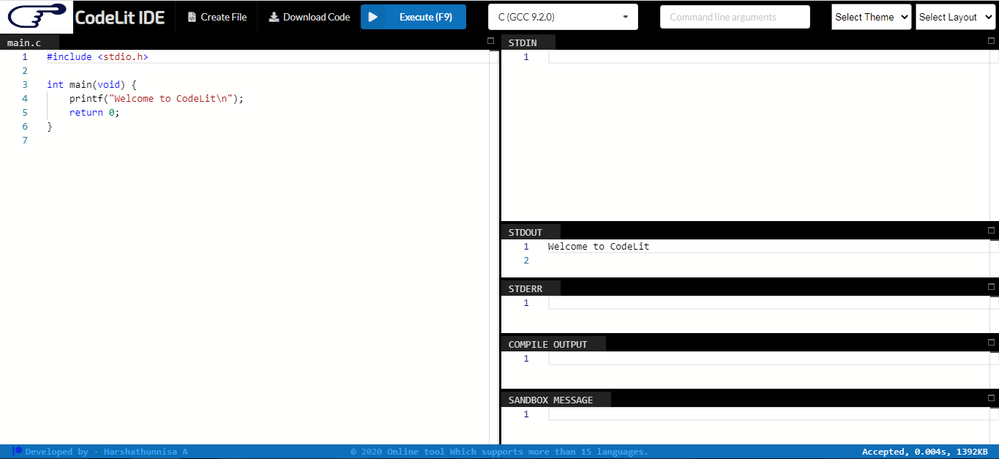

# CodeLit IDE

## About 
   CodeLit is an online compiler and debugging tool which allows you to compile and run code online in more than 15 programming languages. Accelerate your technical hiring, instant setup, initiative testing and real results.

## Features
* User can download his/her code.
* Create a new file
* Can change theme and layout of the compiler.
* 20+ languages are available to code.
* Compile & Execute.

## Look & Feel 

#### Grey Theme  

#### White Theme  

#### Black Theme 

## References
For more reference to how to use the CodeLit IDE online compiler and for your doubts, click on the link given below.

## User Guide
Download the code, then replace the API token and run.

## Compiler Link
To code, Visit https://codelit.glitch.me/

## Developer Contact
* CodeLit IDE was created by Harshathunnisa A
* To contact using linkedin, click https://www.linkedin.com/in/harshathunnisa
* To contact using mail, use harshuanwar@gmail.com
